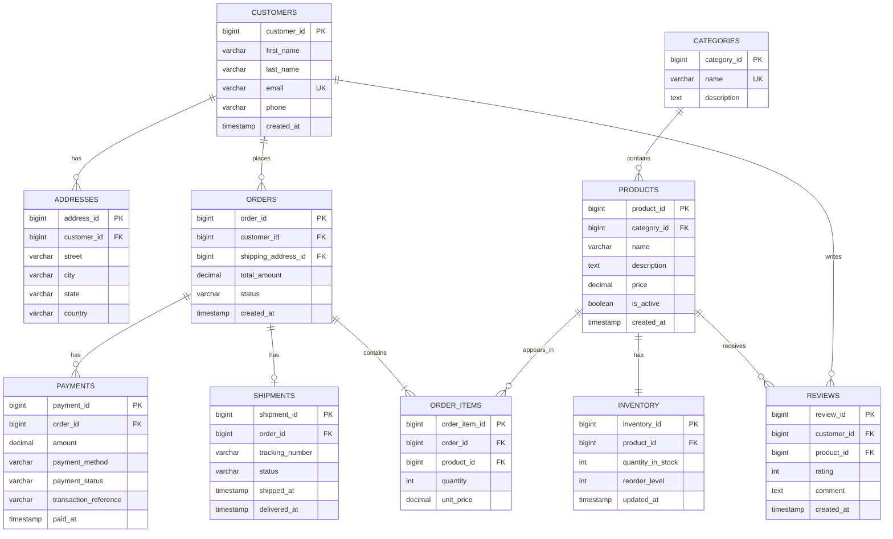

# NexaCart ER Diagram

```mermaid
erDiagram
    CUSTOMERS ||--o{ ADDRESSES : has
    CUSTOMERS ||--o{ ORDERS : places
    CUSTOMERS ||--o{ REVIEWS : writes
    CATEGORIES ||--o{ PRODUCTS : contains
    PRODUCTS ||--|| INVENTORY : has
    PRODUCTS ||--o{ ORDER_ITEMS : appears_in
    PRODUCTS ||--o{ REVIEWS : receives
    ORDERS ||--|{ ORDER_ITEMS : contains
    ORDERS ||--o{ PAYMENTS : has
    ORDERS ||--o| SHIPMENTS : has

    CUSTOMERS {
        bigint customer_id PK
        varchar first_name
        varchar last_name
        varchar email UK
        varchar phone
        timestamp created_at
    }

    ADDRESSES {
        bigint address_id PK
        bigint customer_id FK
        varchar street
        varchar city
        varchar state
        varchar country
    }

    CATEGORIES {
        bigint category_id PK
        varchar name UK
        text description
    }

    PRODUCTS {
        bigint product_id PK
        bigint category_id FK
        varchar name
        text description
        decimal price
        boolean is_active
        timestamp created_at
    }

    INVENTORY {
        bigint inventory_id PK
        bigint product_id FK
        int quantity_in_stock
        int reorder_level
        timestamp updated_at
    }

    ORDERS {
        bigint order_id PK
        bigint customer_id FK
        bigint shipping_address_id FK
        decimal total_amount
        varchar status
        timestamp created_at
    }

    ORDER_ITEMS {
        bigint order_item_id PK
        bigint order_id FK
        bigint product_id FK
        int quantity
        decimal unit_price
    }

    PAYMENTS {
        bigint payment_id PK
        bigint order_id FK
        decimal amount
        varchar payment_method
        varchar payment_status
        varchar transaction_reference
        timestamp paid_at
    }

    SHIPMENTS {
        bigint shipment_id PK
        bigint order_id FK
        varchar tracking_number
        varchar status
        timestamp shipped_at
        timestamp delivered_at
    }

    REVIEWS {
        bigint review_id PK
        bigint customer_id FK
        bigint product_id FK
        int rating
        text comment
        timestamp created_at
    }
```
